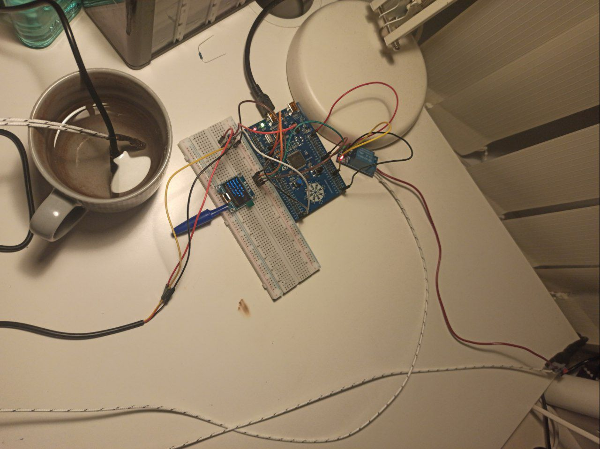
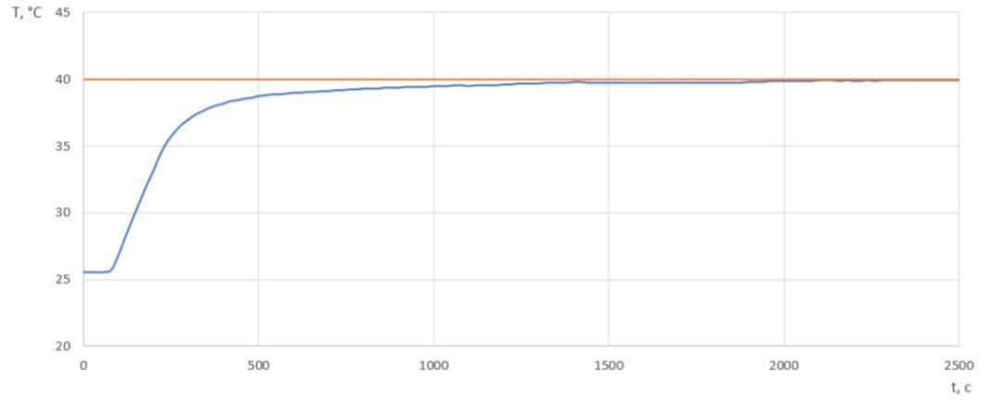
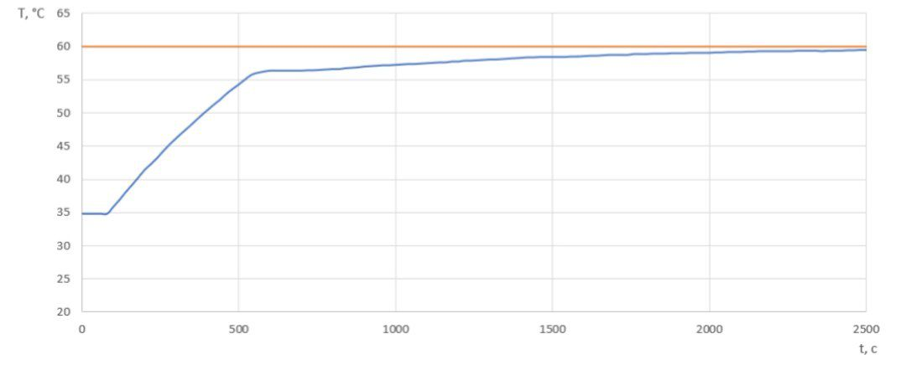
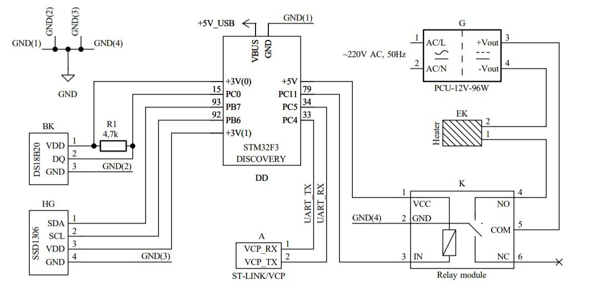
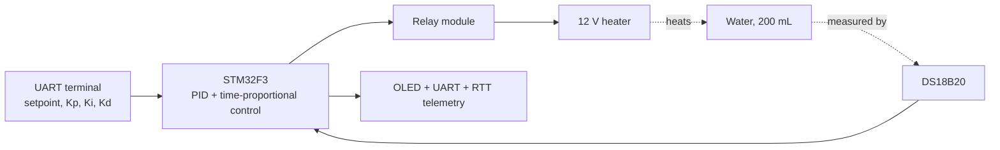
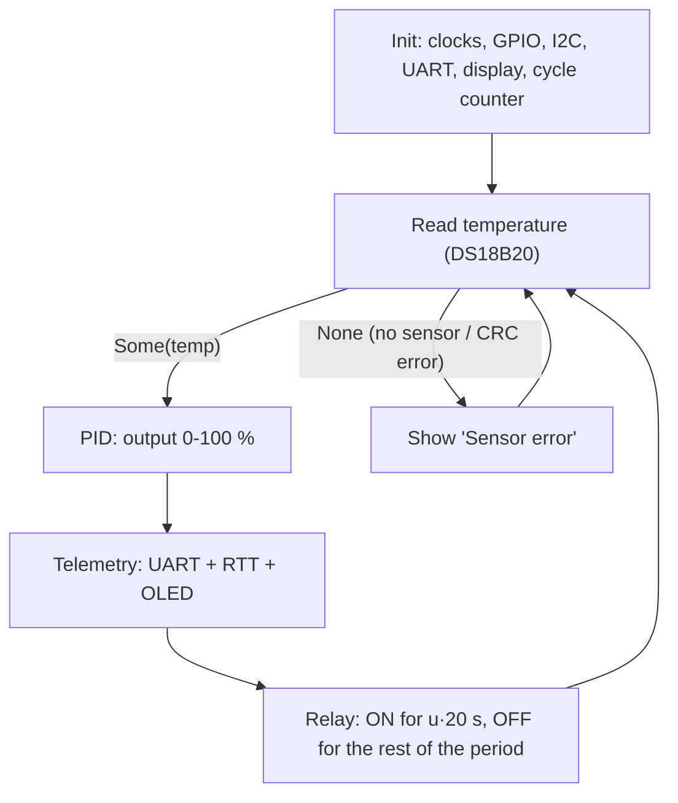

# PID Thermostat on STM32F3Discovery (Rust, bare-metal)

A closed-loop temperature controller for a 200 mL water container, written in bare-metal Rust (`no_std`) for the STM32F3Discovery board. A DS18B20 sensor measures the temperature, a PID controller (with a bang-bang pre-heat stage) computes the required heater power, and a relay switches a 12 V / 50 W submersible heater using slow time-proportional control. The operator changes the setpoint and the PID gains over UART, and telemetry is shown on an OLED display, on the UART terminal and on the RTT debug console.

First-year coursework at RTU MIREA (Institute of Artificial Intelligence, Department of Control Problems), course "Fundamentals of Control Systems Programming". The task goal was to hold the liquid temperature within ±1 °C of the setpoint.



## Features

- **DS18B20 over a bit-banged 1-Wire bus** - reset, bit and byte primitives written from scratch; the scratchpad is validated with a CRC-8 check, resolution 0.0625 °C.
- **PID controller with a bang-bang pre-heat stage** - full power while the error is large, then PID; output clamped to 0-100 %.
- **Time-proportional relay control** - 20 s period with 5 % / 95 % dead bands to limit relay wear.
- **Live tuning over UART** - setpoint, Kp, Ki and Kd can be changed while the system runs.
- **Telemetry on three channels** - SSD1306 OLED (I2C), UART (115200 baud) and RTT (`defmt`).
- **Safe start-up state** - the default setpoint is 0 °C, so the heater stays off until the operator sets a target.
- **No heap** - fixed-size `heapless::String` buffers only.

## Quick start

```bash
rustup target add thumbv7em-none-eabihf
cargo install probe-rs-tools --locked
cargo run --release          # flashes the board and prints RTT output
```

Then open the board's virtual COM port (115200 baud, 8N1; `COMx` on Windows, e.g. `/dev/ttyACM0` on Linux) in PuTTY or any serial terminal and type:

```
sp 40
```

The heater starts working towards 40 °C. See [UART commands](#uart-commands) for the rest.

## Results

Test conditions: ambient temperature 20 °C, 200 mL of water, gains tuned by hand on the finished system.

| Parameter | Value |
|-----------|-------|
| Kp | 12.2 |
| Ki | 0.225 |
| Kd | 0.001 |
| Run 1 | 25.56 °C → 40 °C |
| Run 2 | 35 °C → 60 °C |




In both runs the temperature approaches the setpoint smoothly, without visible oscillation, and ends inside the ±1 °C target band (about 40 °C and 59.5 °C after 2500 s). The final approach is slow: the integral term has to close the last degree, and in run 2 this takes roughly half an hour.

## Hardware

| Role | Part |
|------|------|
| Controller | STM32F3Discovery (STM32F303VCT6), powered over USB |
| Temperature sensor | DS18B20, waterproof, 1-Wire, 4.7 kΩ pull-up |
| Display | SSD1306 0.96" OLED, 128×64, I2C, 4.7 kΩ pull-ups on SDA/SCL |
| Switching element | Electromechanical relay module (SDR-05VDC-SL-C), 5 V coil, active-low input |
| Heater | Submersible, 12 V, 50 W |
| Heater supply | 12 V, 96 W power supply |
| Other | Breadboard, jumper wires |

**Pin map**

| Signal | Pin | Notes |
|--------|-----|-------|
| DS18B20 data (DQ) | PC0 | Open-drain; line level read through the GPIOC `IDR` register |
| SSD1306 SCL / SDA | PB6 / PB7 | I2C1, 400 kHz |
| Relay input | PC11 | Open-drain, active-low: LOW = relay on = heater on; driven HIGH (off) at start-up |
| UART TX / RX | PC4 / PC5 | USART1, 115200 8N1, routed to the on-board ST-LINK virtual COM port |

The relay module is powered from the 5 V pin of the Discovery board. The heater circuit is separate from the MCU supply: its current (about 4 A) flows only through the relay contacts, and only ground is shared with the control side.



> **Safety:** the 12 V supply is fed from mains and the heater sits in water. This is a prototype - do not leave it running unattended.

## How it works



The firmware is a single `loop` in `main()`:



### Main components

| Function / type | Purpose |
|-----------------|---------|
| `read_temperature` | Full DS18B20 transaction: reset, Skip ROM (`0xCC`), Convert T (`0x44`), 750 ms wait, Read Scratchpad (`0xBE`), CRC check, conversion to °C. Returns `Option<f32>`. |
| `ow_reset`, `ow_write_bit/byte`, `ow_read_bit/byte` | 1-Wire primitives with the standard timing slots (480 µs reset, 5/55 µs and 60/5 µs write slots, 3 µs read pulse sampled after 10 µs). |
| `crc8` | Dallas/Maxim CRC-8 (reflected polynomial `0x8C`) used to validate the 9-byte scratchpad. |
| `Pid::pid_output` | Bang-bang stage plus PID; returns the heater power in percent. |
| `pwm` | Time-proportional control of the relay over a 20 s period. |
| `effective_delay` | 1 ms delay loop that polls the UART between ticks, so commands are still received while the program waits. |
| `user_input_read`, `user_input_parse` | Line assembly from UART bytes and command parsing. |
| `I2cCompat` | Small adapter between the HAL's `embedded-hal` 0.2 blocking I2C traits and the `embedded-hal` 1.0 `I2c` trait required by the SSD1306 driver. |

### Control algorithm

With `e = setpoint - temperature`:

1. **Bang-bang pre-heat.** If `e` exceeds a threshold that depends on the setpoint, the output is 100 %. Thresholds: 7 °C for setpoints above 35 °C, 5 °C above 50 °C, 4 °C above 65 °C; for setpoints of 35 °C or below the stage is disabled. The values were tuned empirically for this rig.
2. **PID.** `u = Kp·e + Ki·Σ(e·dt) + Kd·(e - e_prev)/dt`, clamped to 0-100 %. Each integral increment is limited to ±50.
3. **Relay.** Outputs below 5 % become 0 %, outputs above 95 % become 100 %. Otherwise the relay is on for `u × 20 s` and off for the remainder of the period.

Defaults at start-up: Kp = 2, Ki = 0, Kd = 0, setpoint = 0 °C (heater off). The tuned gains from the results above are entered at runtime. Changing the setpoint resets the integral term and the stored previous error.

### UART commands

Lines end with Enter (`\r` or `\n`). Commands are lowercase, case-sensitive, and the argument is separated by a space. Lines longer than 32 characters are discarded.

| Command | Argument | Effect |
|---------|----------|--------|
| `sp <value>` | 20-80 (°C) | Set the target temperature. Values outside the range are rejected. |
| `kp <value>` | float | Set the proportional gain. |
| `ki <value>` | float | Set the integral gain. |
| `kd <value>` | float | Set the derivative gain. |
| `stats` | - | Print Kp, Ki, Kd and the current integral term. |
| `help` | - | Print a short help message. |

Replies to commands and error messages (`error: invalid number format`, `unknown command ...`) are printed to the RTT console.

Telemetry is sent over UART and RTT after every temperature reading (about every 21 s), for example:

```
Temp: 38.25 °C | Time: 540 |Setpoint: 40.00 °C | Output: 62.15 % | Error: 1.75 °C
```

The same values are drawn on the OLED display.

## Build, flash and use

Requirements: Rust 1.85 or newer (the crate uses edition 2024), the `thumbv7em-none-eabihf` target, and [probe-rs](https://probe.rs/docs/getting-started/installation/) for flashing and RTT output. On Linux, make sure the udev rules allow access to the ST-LINK.

```bash
cargo run --release
```

`cargo run` uses `probe-rs` as the runner (see `.cargo/config.toml`), flashes the board and streams the `defmt` output to the terminal.

For the UART terminal, use the board's virtual COM port. On the STM32F3Discovery this port is wired to PC4/PC5 on PCB revision C and newer.

Main dependencies: `stm32f3xx-hal` 0.10, `cortex-m` / `cortex-m-rt`, `embedded-hal` 1.0, `ssd1306`, `embedded-graphics`, `heapless`, `defmt` + `defmt-rtt`, `panic-probe`.

## Telemetry logging

`tools/logger.py` appends the telemetry lines received from the serial port to `log1.csv`, so that temperature curves can be plotted afterwards.

```bash
pip install pyserial
python tools/logger.py        # edit PORT at the top of the script first
```

The script writes each received line as it is, so the fields still need to be split into columns (for example in a spreadsheet) before plotting.

## Known limitations

This project was written before I knew about interrupts, DMA or RTOS-style frameworks. Documenting it, these are the issues worth knowing about:

1. **Blocking, polled design.** The 750 ms conversion wait and the 20 s relay period are busy delays, and UART input is polled once per millisecond inside them. At most one byte per millisecond can be consumed, so a burst of input (for example a pasted command) can overrun the receiver; typing at human speed works.
2. **PID details differ from the textbook form.** `dt` is fixed at 1.0 although one control iteration takes about 21 s, so Ki and Kd act per iteration instead of per second (the gains were tuned empirically for this period). The ±50 clamp limits each integral *increment*, not the accumulated sum, so there is no true anti-windup; during large errors the bang-bang stage skips integration, which hides the problem in normal heat-ups. Kd is very small (0.001), so the controller is effectively PI.
3. **Sensor loss is not handled safely.** If the sensor read fails (no sensor or CRC error), the display shows `Sensor error` and the loop retries, but the relay is not explicitly switched off in that branch. It keeps the state in which the previous control cycle ended, which is *on* when the output was saturated at 100 %.
4. **Command feedback goes to RTT only.** Replies to `sp`, `kp`, `ki`, `kd`, `stats` and `help`, and all error messages, are printed with `defmt::println!`. The UART carries only the telemetry stream and the start-up banner, so an operator using PuTTY alone gets no acknowledgement.
5. **Bang-bang thresholds are empirical.** They were tuned for the 200 mL rig and are not derived from a model; another volume or heater needs re-tuning.
6. **Smaller items.** Timestamps are accumulated with integer-second truncation, so they read about 3-4 % low. The DS18B20 is addressed with Skip ROM, so only one sensor on the bus is supported. PID logic and hardware access live in one file, so nothing is unit-tested on a PC.

## Follow-up project

The first-order problems above (polling, delay loops, no interrupts) are addressed in my follow-up project, a UART-controlled heater driver built on RTIC: interrupt-driven UART reception with circular DMA and IDLE-line detection, hardware-timer PWM instead of delay loops, a CRC-16 checked command protocol, and a hardware emergency stop with explicit task priorities.

## Repository layout

```
.
├── Cargo.toml
├── Cargo.lock
├── memory.x               # linker memory layout for the STM32F303VC
├── .cargo/config.toml     # target, linker script, probe-rs runner
├── src/main.rs            # firmware
├── tools/logger.py        # serial-to-CSV telemetry logger
└── docs/
    ├── img/               # photos, plots and the schematic used in this README
    └── hardware/          # KiCad project
```
